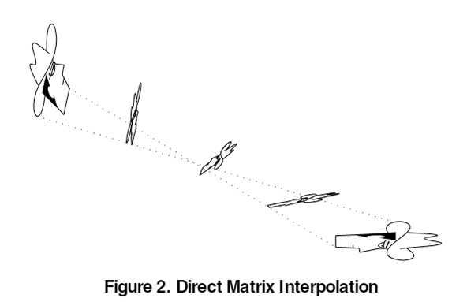
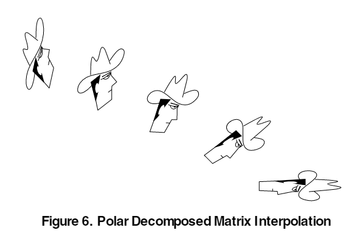

# Affine Decomposition
A decomposition algorithm of Affine transform matrix for animation interpolation for Unity.
By decomposing Model View matrix into translation, rotation, scaling factors, interpolated matrix of two key matrices protec its scale from rotation.

> 
> 
Images from Ref. 1

## Example

Decompose Model View matrix is factored into translate/rotate/scale as Affine.
```csharp
var decomposed = (Affine)(Matrix4x4.Scale(new Vector3(1f, 1f, -1f) 
  * Camera.main.worldToCameraMatrix 
  * transform.localToWorldMatrix;
```

Affine matrix can be simply interpolated by Lerp() function.
```csharp
var interpolated = Affine.Lerp(keyFrame0, keyFrame1, t);
```

Affine can be converted into Matrix4x4.
```csharp
var modelView = (Matrix4x4)interpolated;
```

## Demo
[](https://youtu.be/tZ3TyIUie3A)
[](https://youtu.be/UtXhv53DYkI)

## References
1. Shoemake, K. & Duff, T. Matrix Animation and Polar Decomposition. Proceedings of the conference on Graphics interface ’92 (1992) doi:10.5555/155294.155324.
1. Higham, N. J. Computing the Polar Decomposition—with Applications. Siam J Sci Stat Comp 7, 1160–1174 (1986).
